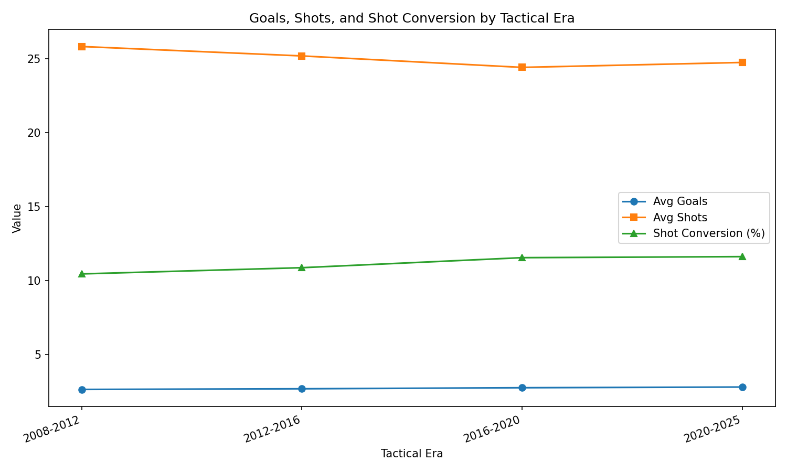
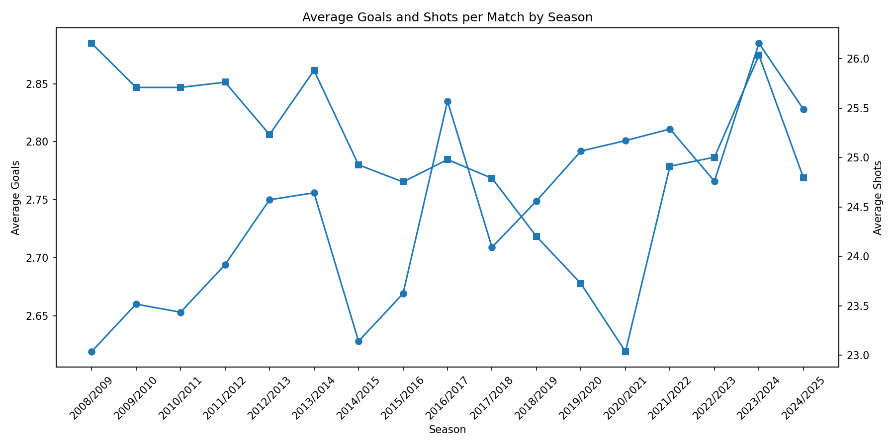
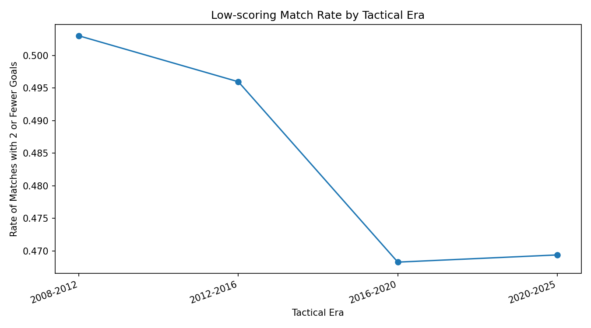
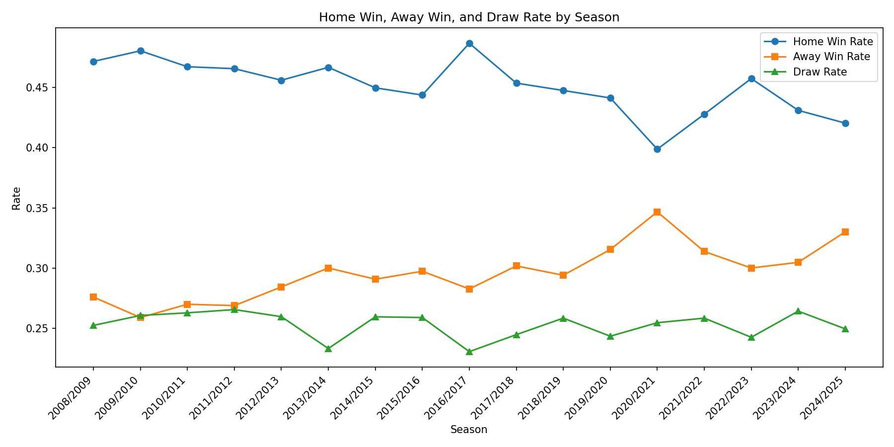
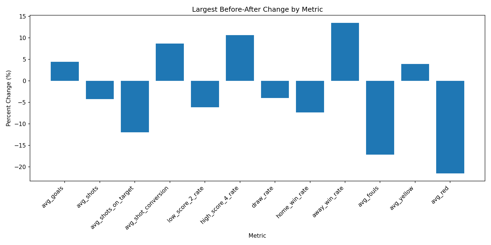

# 2008/09~2024/25 유럽 주요 리그 경기 통계 기반 현대 축구 경기 양상 변화 분석

## 1. 프로젝트 개요

본 프로젝트는 유럽 축구가 과거에 비해 어떻게 변화했는지 분석하기 위한 빅데이터 프로그래밍 프로젝트이다.

최근 축구에서는 전술이 정형화되고, 팀들이 리스크를 줄이는 방식으로 운영되면서 풀경기의 재미가 줄었다는 인식이 있다. 본 프로젝트는 이러한 인식이 실제 경기 데이터에서도 확인되는지 분석하기 위해 2008/09 시즌부터 2024/25 시즌까지의 유럽 주요 5대 리그 경기 데이터를 수집하고, 경기당 슈팅 수, 유효슈팅 수, 평균 득점, 슈팅 전환율, 저득점 경기 비율, 홈/원정 승률, 파울 및 카드 지표를 비교하였다.

핵심 질문은 다음과 같다.

> 현대 축구는 과거보다 정말 수비적이고 재미없어졌는가?

본 프로젝트의 분석 결과, 현대 축구는 단순히 수비적으로 변했다기보다는, 슈팅 수는 줄었지만 더 효율적으로 득점하는 방향으로 변화한 것으로 나타났다.

---

## 2. 문제 정의

본 프로젝트에서 풀고자 하는 문제는 다음과 같다.

1. 현대 축구는 과거보다 경기당 슈팅 수가 감소했는가?
2. 슈팅 수가 줄었다면 평균 득점도 함께 감소했는가?
3. 현대 축구에서 슈팅 대비 득점 효율은 증가했는가?
4. 저득점 경기는 과거보다 증가했는가?
5. 홈 어드밴티지는 시간이 지남에 따라 약화되었는가?
6. 경기의 거칠기 또는 흐름 중단을 나타내는 파울, 카드 지표는 어떻게 변화했는가?
7. 변화가 가장 크게 나타나는 기준 시즌은 언제인가?

이를 통해 현대 축구의 경기 양상이 단순히 “수비적”으로 바뀐 것인지, 아니면 “효율 중심”으로 변화한 것인지 확인하고자 한다.

---

## 3. 사용 데이터

### 3.1 Main Dataset: football-data.co.uk Match Statistics

본 프로젝트의 핵심 분석 데이터는 football-data.co.uk에서 제공하는 유럽 주요 리그 경기 통계 CSV 데이터이다.

| 항목    | 내용                                                    |
| ----- | ----------------------------------------------------- |
| 기간    | 2008/09 ~ 2024/25                                     |
| 리그    | Premier League, La Liga, Serie A, Bundesliga, Ligue 1 |
| 파일 수  | 85개 CSV                                               |
| 경기 수  | 30,790경기                                              |
| 주요 컬럼 | 득점, 슈팅, 유효슈팅, 파울, 코너킥, 옐로카드, 레드카드, 경기 결과              |

분석에 사용한 주요 변수는 다음과 같다.

| 변수                       | 설명               |
| ------------------------ | ---------------- |
| `total_goals`            | 경기당 총 득점         |
| `total_shots`            | 경기당 총 슈팅 수       |
| `total_shots_on_target`  | 경기당 총 유효슈팅 수     |
| `shot_conversion_rate`   | 슈팅 대비 득점 전환율     |
| `shot_on_target_rate`    | 전체 슈팅 중 유효슈팅 비율  |
| `low_scoring_2_or_less`  | 총 득점 2골 이하 경기 여부 |
| `high_scoring_4_or_more` | 총 득점 4골 이상 경기 여부 |
| `home_win_flag`          | 홈팀 승리 여부         |
| `away_win_flag`          | 원정팀 승리 여부        |
| `draw_flag`              | 무승부 여부           |
| `total_fouls`            | 경기당 총 파울 수       |
| `total_yellow`           | 경기당 총 옐로카드 수     |
| `total_red`              | 경기당 총 레드카드 수     |

### 3.2 Auxiliary Dataset: European Soccer Database

Kaggle의 European Soccer Database도 함께 수집하였다. 해당 데이터는 프로젝트의 보조 데이터 및 대용량 데이터 조건 충족을 위해 사용하였다.

| 테이블               | 설명             |
| ----------------- | -------------- |
| Country           | 국가 정보          |
| League            | 리그 정보          |
| Match             | 경기 정보          |
| Team              | 팀 정보           |
| Team_Attributes   | 팀별 전술 및 속성 정보  |
| Player            | 선수 기본 정보       |
| Player_Attributes | 선수 능력치 및 평점 정보 |

해당 데이터는 SQLite DB 형태로 제공되며, 프로젝트에서는 Python을 이용해 테이블별 CSV로 변환한 뒤 HDFS에 적재하였다.

---

## 4. 기술 스택

본 프로젝트에서는 강의에서 다룬 Hadoop 기반 빅데이터 처리 기술을 중심으로 다음 도구를 사용하였다.

| 구분       | 사용 도구                  | 역할                        |
| -------- | ---------------------- | ------------------------- |
| 데이터 수집   | Bash, curl, Kaggle API | 공개 축구 데이터 다운로드 자동화        |
| 데이터 변환   | Python, SQLite         | SQLite DB를 CSV로 변환        |
| 데이터 저장   | HDFS                   | 원본 데이터, 전처리 데이터, 분석 결과 저장 |
| 데이터 전처리  | Python                 | 원본 CSV 표준화 및 파생 변수 생성     |
| 분산 처리    | Apache Spark           | 시즌별·리그별·구간별 집계 분석         |
| 분석 결과 저장 | HDFS, CSV              | Spark 결과 저장 및 로컬 병합       |
| 시각화      | Python, Matplotlib     | 분석 결과 그래프 생성              |
| 버전 관리    | Git, GitHub            | 코드 및 결과 관리                |

---

## 5. 프로젝트 파이프라인

전체 파이프라인은 다음과 같다.

```text
1. 데이터 수집
   - football-data.co.uk에서 2008/09~2024/25 시즌 Top 5 리그 CSV 다운로드
   - Kaggle API로 European Soccer Database 다운로드

2. 데이터 변환
   - SQLite DB를 테이블별 CSV로 변환
   - football-data CSV 85개를 하나의 표준화된 경기 통계 데이터로 통합

3. HDFS 적재
   - 원본 football-data CSV 적재
   - Kaggle 변환 CSV 적재
   - 표준화된 processed CSV 적재

4. Spark 분석
   - 시즌별 경기 양상 분석
   - 리그별 경기 양상 분석
   - 과거/현대 구간 비교
   - 변화 지점 탐색

5. 결과 저장
   - season_summary.csv
   - period_summary.csv
   - league_summary.csv
   - tactical_era_summary.csv
   - change_point_summary.csv

6. 시각화
   - 시대별 득점·슈팅·전환율 비교
   - 시즌별 득점/슈팅 변화
   - 저득점 경기 비율 변화
   - 홈/원정/무승부 비율 변화
   - 변화 지점별 차이 시각화
```

---

## 6. 디렉토리 구조

```text
.
├── README.md
├── .gitignore
├── src
│   ├── ingest
│   │   ├── download_football_data_matches.sh
│   │   ├── download_modern_matches.sh
│   │   ├── export_sqlite_to_csv.py
│   │   ├── standardize_football_data_matches.py
│   │   ├── standardize_historical_matches.py
│   │   └── standardize_modern_matches.py
│   ├── pipeline
│   │   └── analyze_match_dynamics_spark.py
│   └── analyze
│       ├── change_point_analysis.py
│       ├── visualize_match_dynamics.py
│       └── visualize_advanced_results.py
├── results
│   ├── tables
│   │   ├── period_summary.csv
│   │   ├── season_summary.csv
│   │   ├── league_summary.csv
│   │   ├── tactical_era_summary.csv
│   │   └── change_point_summary.csv
│   └── figures
│       ├── era_goals_shots_conversion.png
│       ├── season_goals_vs_shots.png
│       ├── era_low_score_2_rate.png
│       ├── season_home_away_draw_rate.png
│       └── change_point_percent_change.png
```

대용량 원본 데이터는 GitHub에 업로드하지 않고 `.gitignore`로 제외하였다.

---

## 7. 주요 분석 결과

### 7.1 과거 구간과 현대 구간 비교

| 구간        |   경기 수 | 평균 득점 |  평균 슈팅 | 평균 유효슈팅 | 슈팅 전환율 | 2골 이하 경기 비율 |   홈 승률 |  원정 승률 |
| --------- | -----: | ----: | -----: | ------: | -----: | ----------: | -----: | -----: |
| 2008-2016 | 14,607 | 2.679 | 25.517 |   9.532 | 0.1067 |      0.4995 | 0.4625 | 0.2808 |
| 2016-2025 | 16,183 | 2.797 | 24.607 |   8.870 | 0.1160 |      0.4691 | 0.4405 | 0.3098 |

분석 결과, 현대 구간에서는 평균 슈팅과 유효슈팅 수가 감소했지만 평균 득점과 슈팅 전환율은 증가하였다. 이는 현대 축구가 단순히 수비적으로 변화했다기보다는, 더 적은 슈팅으로 더 효율적으로 득점하는 방향으로 변화했을 가능성을 보여준다.

### 7.2 전술 시대 구간별 비교

| 구간        |  평균 득점 |   평균 슈팅 | 평균 유효슈팅 |  슈팅 전환율 | 2골 이하 경기 비율 |   홈 승률 |  원정 승률 |
| --------- | -----: | ------: | ------: | ------: | ----------: | -----: | -----: |
| 2008-2012 | 2.6565 |  25.835 | 10.0215 | 0.10465 |      0.5030 | 0.4711 | 0.2685 |
| 2012-2016 | 2.7008 |  25.199 |  9.0438 | 0.10885 |      0.4960 | 0.4539 | 0.2932 |
| 2016-2020 | 2.7713 | 24.4245 |  8.9340 | 0.11563 |      0.4683 | 0.4572 | 0.2985 |
| 2020-2025 | 2.8182 |  24.757 |  8.8232 | 0.11632 |      0.4694 | 0.4270 | 0.3191 |

시대별 비교에서도 유사한 흐름이 나타났다. 시간이 지날수록 평균 슈팅과 유효슈팅은 감소했지만, 평균 득점과 슈팅 전환율은 증가하였다.

### 7.3 변화 지점 탐색

변화 지점 분석 결과, 주요 지표별로 다음과 같은 기준 시즌이 확인되었다.

| 지표          | 변화 지점   | 변화 방향 |
| ----------- | ------- | ----- |
| 평균 득점       | 2016/17 | 증가    |
| 평균 슈팅       | 2014/15 | 감소    |
| 평균 유효슈팅     | 2013/14 | 감소    |
| 슈팅 전환율      | 2016/17 | 증가    |
| 2골 이하 경기 비율 | 2016/17 | 감소    |
| 홈 승률        | 2020/21 | 감소    |
| 평균 파울       | 2011/12 | 감소    |
| 평균 레드카드     | 2016/17 | 감소    |

이를 통해 슈팅 수 감소는 2010년대 중반부터 나타났고, 2016/17 이후에는 득점 효율 증가와 저득점 경기 비율 감소가 뚜렷하게 나타난 것을 확인할 수 있었다.

---

## 8. 주요 시각화

### 8.1 시대별 득점, 슈팅, 전환율 변화



### 8.2 시즌별 평균 득점과 평균 슈팅 변화



### 8.3 시대별 저득점 경기 비율 변화



### 8.4 홈 승률, 원정 승률, 무승부 비율 변화



### 8.5 변화 지점별 변화율



---

## 9. 결론

본 프로젝트는 2008/09~2024/25 시즌 유럽 주요 5대 리그 경기 통계를 기반으로 현대 축구의 경기 양상 변화를 분석하였다.

분석 결과, 현대 축구는 과거보다 경기당 평균 슈팅 수와 유효슈팅 수가 감소했지만, 평균 득점과 슈팅 대비 득점 전환율은 증가하였다. 또한 2골 이하 저득점 경기 비율은 감소하였다. 따라서 현대 축구가 단순히 수비적이고 저득점화되었다고 보기는 어렵다.

오히려 현대 축구는 공격 시도 자체를 늘리기보다는 더 좋은 기회를 선택하고, 더 높은 효율로 득점하는 방향으로 변화한 것으로 해석할 수 있다. 즉, “현대 축구가 재미없어졌다”는 인식은 득점 감소나 저득점 경기 증가만으로 설명되기 어렵고, 공격 과정의 정형화, 개인 플레이 감소, 전술적 효율화 등 추가적인 요소와 함께 분석할 필요가 있다.

---

## 10. 한계 및 확장 방향

본 프로젝트는 경기 결과와 기본 경기 통계 데이터를 중심으로 분석하였다. 따라서 축구의 “재미”를 직접적으로 측정했다고 보기는 어렵다. 경기의 재미는 득점, 슈팅 수뿐만 아니라 경기 템포, 압박 강도, 개인 돌파, 전술 다양성, 스타 플레이어 의존도 등 다양한 요인에 의해 결정된다.

향후 확장 방향은 다음과 같다.

1. 선수 개인 성과 집중도 분석

   * 리그 득점 상위권 선수의 득점 점유율 변화
   * 특정 슈퍼스타 의존도 변화 분석

2. 교체 효과 분석

   * 교체 시점 전후 슈팅 및 득점 변화 분석
   * 교체가 경기 흐름에 미치는 영향 분석

3. 압박 전술과 부상 위험 분석

   * 압박 강도, 활동량, 경기 수, 부상자 수를 결합한 분석

4. 이벤트 데이터 기반 경기 템포 분석

   * 패스, 압박, 슈팅 위치, 공격 전개 속도 등 세부 이벤트 분석

5. 리그별 전술 변화 비교

   * EPL, La Liga, Serie A, Bundesliga, Ligue 1 간 변화 패턴 비교
