# 2008/09~2024/25 유럽 축구 데이터 기반 현대 축구 경기 양상 변화 분석

## 1. 프로젝트 개요

본 프로젝트는 유럽 축구가 과거에 비해 어떻게 변화했는지 분석하기 위한 빅데이터 프로그래밍 프로젝트이다.

최근 축구에서는 전술이 정형화되고, 리스크를 줄이는 경기 운영이 늘어나면서 풀경기의 재미가 줄었다는 인식이 있다. 그러나 이러한 인식이 실제 경기 데이터에서도 확인되는지는 별도로 검증할 필요가 있다.

본 프로젝트는 축구의 “재미”나 시청 행태를 직접 측정하지는 않는다. 대신 풀경기 체감과 관련될 수 있는 경기 내 지표, 즉 슈팅 수, 유효슈팅 수, 평균 득점, 슈팅 전환율, 저득점 경기 비율, 홈/원정 승률, xG 기반 공격 기회 품질, 상위권 팀 간 빅게임 양상, 이벤트 단위 경기 구성 지표를 분석하였다.

핵심 질문은 다음과 같다.

> 현대 축구는 과거보다 정말 수비적이고 재미없어졌는가?

분석 결과, 현대 축구는 단순히 수비적이고 저득점화되었다기보다는, 슈팅 수는 줄거나 정체되는 반면 더 높은 품질의 기회를 만들고 더 효율적으로 득점하는 방향으로 변화한 것으로 나타났다.

---

## 2. 문제 정의

본 프로젝트에서 분석하고자 하는 문제는 다음과 같다.

1. 현대 축구는 과거보다 경기당 슈팅 수가 감소했는가?
2. 슈팅 수가 감소했다면 평균 득점도 함께 감소했는가?
3. 현대 축구에서 슈팅 대비 득점 효율은 증가했는가?
4. 저득점 경기는 과거보다 증가했는가?
5. xG 기준으로 볼 때 슈팅 기회의 평균 품질은 높아졌는가?
6. 상위권 팀 간 빅게임은 전체 경기 평균과 다른 양상을 보이는가?
7. 경기당 이벤트 수, 슈팅 이벤트, 키패스, 빠른 공격 등 경기 체감과 관련된 이벤트 구성은 어떻게 나타나는가?
8. 이러한 변화는 모든 리그에서 동일하게 나타나는가?

이를 통해 현대 축구가 단순히 “수비적”으로 변한 것인지, 아니면 “공격 효율화”와 “기회 선택성 증가”의 방향으로 변화한 것인지 확인하고자 한다.

---

## 3. 사용 데이터

### 3.1 football-data.co.uk Match Statistics

본 프로젝트의 핵심 장기 분석 데이터는 football-data.co.uk에서 제공하는 유럽 주요 리그 경기 통계 CSV 데이터이다.

| 항목    | 내용                                                    |
| ----- | ----------------------------------------------------- |
| 기간    | 2008/09 ~ 2024/25                                     |
| 리그    | Premier League, La Liga, Serie A, Bundesliga, Ligue 1 |
| 파일 수  | 85개 CSV                                               |
| 경기 수  | 30,790경기                                              |
| 주요 컬럼 | 득점, 슈팅, 유효슈팅, 파울, 코너킥, 옐로카드, 레드카드, 경기 결과              |

분석에 사용한 주요 변수는 다음과 같다.

| 변수                       | 설명               |
| ------------------------ | ---------------- |
| `total_goals`            | 경기당 총 득점         |
| `total_shots`            | 경기당 총 슈팅 수       |
| `total_shots_on_target`  | 경기당 총 유효슈팅 수     |
| `shot_conversion_rate`   | 슈팅 대비 득점 전환율     |
| `shot_on_target_rate`    | 전체 슈팅 중 유효슈팅 비율  |
| `low_scoring_2_or_less`  | 총 득점 2골 이하 경기 여부 |
| `high_scoring_4_or_more` | 총 득점 4골 이상 경기 여부 |
| `home_win_flag`          | 홈팀 승리 여부         |
| `away_win_flag`          | 원정팀 승리 여부        |
| `draw_flag`              | 무승부 여부           |
| `total_fouls`            | 경기당 총 파울 수       |
| `total_yellow`           | 경기당 총 옐로카드 수     |
| `total_red`              | 경기당 총 레드카드 수     |

### 3.2 Kaggle Understat Data

기존 경기 통계만으로는 “슈팅 수 감소가 단순한 공격 감소인지, 아니면 더 좋은 기회를 선택하는 변화인지”를 설명하기 어렵다. 이를 보완하기 위해 Kaggle에서 제공되는 Understat 기반 xG 데이터를 추가로 사용하였다.

| 항목    | 내용                                              |
| ----- | ----------------------------------------------- |
| 기간    | 2014/15 ~ 2023/24                               |
| 리그    | 유럽 주요 리그                                        |
| 분석 단위 | 팀-경기 단위                                         |
| 주요 컬럼 | xG, xGA, npxG, PPDA, deep, scored, missed, xpts |

Understat 데이터는 다음 분석에 사용하였다.

| 변수       | 설명                   |
| -------- | -------------------- |
| `xG`     | 팀의 경기별 기대득점          |
| `npxG`   | 페널티 제외 기대득점          |
| `ppda`   | 압박 성향을 해석할 수 있는 지표   |
| `deep`   | 상대 위험 지역 진입/침투 관련 지표 |
| `scored` | 실제 득점                |
| `xpts`   | 기대 승점                |

이 데이터는 football-data.co.uk 데이터와 결합하여 `xG per shot proxy`를 계산하는 데 활용하였다. 이는 실제 슈팅 단위 xG와 완전히 동일하지는 않지만, 시즌별 공격 기회 품질 변화를 근사적으로 확인하는 데 사용하였다.

### 3.3 Kaggle football-events Event Data

100MB 이상의 대용량 데이터를 실제 분석에 활용하기 위해 Kaggle football-events 데이터도 추가로 사용하였다. 해당 데이터는 경기 단위 요약 통계가 아니라, 경기 중 발생한 이벤트를 행 단위로 기록한 이벤트 데이터이다.

| 항목    | 내용                                         |
| ----- | ------------------------------------------ |
| 기간    | 2012 ~ 2017                                |
| 리그    | EPL, Ligue 1, Serie A, La Liga, Bundesliga |
| 경기 수  | 10,112경기                                   |
| 이벤트 수 | 941,009개                                   |
| 주요 파일 | events.csv, ginf.csv                       |
| 크기    | events.csv 약 173MB, 전체 폴더 약 196MB          |

주요 이벤트 컬럼은 다음과 같다.

| 변수            | 설명                             |
| ------------- | ------------------------------ |
| `event_type`  | 슈팅, 코너킥, 파울, 카드, 교체 등 이벤트 유형   |
| `event_type2` | 키패스, 실패한 스루패스, 자책골 등 세부 이벤트 유형 |
| `time`        | 이벤트 발생 시간                      |
| `event_team`  | 이벤트 발생 팀                       |
| `opponent`    | 상대 팀                           |
| `is_goal`     | 득점 여부                          |
| `location`    | 슈팅 또는 이벤트 발생 위치                |
| `fast_break`  | 빠른 공격 여부                       |

본 프로젝트에서는 해당 이벤트 데이터를 HDFS에 적재한 뒤, Spark를 이용하여 시즌별·리그별 이벤트 구성 지표를 집계하였다. 이 데이터는 장기 추세 분석의 핵심 데이터라기보다는, 풀경기 체감과 관련된 이벤트 단위 분석 가능성을 보완하고, 100MB 이상의 대용량 데이터를 실제 Spark 분석에 활용하기 위한 데이터로 사용하였다.

### 3.4 Kaggle European Soccer Database

Kaggle European Soccer Database는 SQLite 형태의 대용량 축구 데이터로, 본 프로젝트에서는 Kaggle API를 통한 대용량 데이터 수집, SQLite 테이블의 CSV 변환, HDFS 적재 과정을 검증하는 데 사용하였다.

| 항목      | 내용                                                                       |
| ------- | ------------------------------------------------------------------------ |
| 기간      | 2008/09 ~ 2015/16                                                        |
| 원본 형식   | SQLite database                                                          |
| 변환 후 형식 | CSV                                                                      |
| 크기      | 약 300MB                                                                  |
| 주요 테이블  | Country, League, Match, Team, Team_Attributes, Player, Player_Attributes |

다만 해당 데이터는 2015/16 시즌까지만 포함하므로, 2016/17 이후 현대 축구 변화 분석의 핵심 데이터로 사용하기에는 한계가 있다. 따라서 최종 경기 양상 분석은 football-data.co.uk, Understat, football-events 데이터를 중심으로 수행하였다.

---

## 4. 기술 스택

| 구분      | 사용 도구                  | 역할                        |
| ------- | ---------------------- | ------------------------- |
| 데이터 수집  | Bash, curl, Kaggle API | 공개 축구 데이터 다운로드            |
| 데이터 변환  | Python, SQLite         | SQLite DB를 CSV로 변환        |
| 데이터 저장  | HDFS                   | 원본 데이터, 전처리 데이터, 분석 결과 저장 |
| 데이터 전처리 | Python                 | 원본 CSV 표준화 및 파생 변수 생성     |
| 분산 처리   | Apache Spark           | 시즌별·리그별·이벤트 단위 집계 분석      |
| 추가 분석   | Python                 | 변화 지점 탐색, xG 분석, 빅게임 분석   |
| 시각화     | Python, Matplotlib     | 분석 결과 그래프 생성              |
| 버전 관리   | Git, GitHub            | 코드 및 결과 관리                |

본 프로젝트는 HDFS를 대용량 데이터 저장 계층으로 사용하고, Apache Spark를 분산 처리 엔진으로 활용하였다. 또한 Kaggle API와 Python 기반 전처리·분석 스크립트를 사용하여 데이터 수집, 정제, 분석, 시각화 파이프라인을 구성하였다.

---

## 5. 프로젝트 파이프라인

전체 파이프라인은 다음과 같다.

```text
1. 데이터 수집
   - football-data.co.uk에서 2008/09~2024/25 시즌 5대 리그 CSV 다운로드
   - Kaggle API로 Understat 데이터 다운로드
   - Kaggle API로 football-events 이벤트 데이터 다운로드
   - Kaggle API로 European Soccer Database 다운로드

2. 데이터 변환
   - SQLite DB를 테이블별 CSV로 변환
   - football-data CSV 85개를 하나의 표준화된 경기 통계 데이터로 통합

3. HDFS 적재
   - 원본 football-data CSV 적재
   - Kaggle football-events의 events.csv, ginf.csv 적재
   - Kaggle European Soccer Database 변환 CSV 적재
   - 표준화된 processed CSV 적재

4. Spark 분석
   - 시즌별 경기 양상 분석
   - 리그별 경기 양상 분석
   - 과거/현대 구간 비교
   - 전술 시대 구간별 비교
   - football-events 이벤트 데이터 기반 시즌별·리그별 이벤트 구성 분석

5. 추가 분석
   - 지표별 변화 지점 탐색
   - 지표별 변화 지점 기준 리그별 변화 분석
   - Understat xG 기반 공격 기회 품질 분석
   - 상위권 팀 간 빅게임 분석

6. 결과 저장
   - season_summary.csv
   - period_summary.csv
   - league_summary.csv
   - tactical_era_summary.csv
   - change_point_summary.csv
   - league_metric_change_by_split.csv
   - understat_xg_shot_quality_summary.csv
   - big_match_era_summary.csv
   - big_match_change_summary.csv
   - event_season_summary.csv
   - event_league_summary.csv

7. 시각화
   - 시대별 슈팅·득점·전환율 비교
   - 시즌별 지수화 추세 비교
   - 저득점/고득점 경기 비율 변화
   - xG 기반 공격 기회 품질 변화
   - 빅게임의 슈팅·득점 변화
```

---

## 6. 실행 방법

본 프로젝트는 데이터 수집부터 결과 산출까지의 주요 과정을 `scripts/run_pipeline.sh`로 자동화하였다.

```bash
bash scripts/run_pipeline.sh
```

해당 스크립트는 다음 과정을 순서대로 수행한다.

1. 프로젝트 디렉토리 및 결과 폴더 생성
2. football-data.co.uk 경기 통계 CSV 다운로드
3. Kaggle Understat 데이터 다운로드
4. Kaggle football-events 데이터 다운로드
5. football-data 경기 통계 표준화
6. 원본 및 전처리 데이터 HDFS 적재
7. Spark 기반 시즌별·리그별 경기 양상 분석
8. Spark 기반 football-events 이벤트 데이터 분석
9. HDFS 분석 결과를 로컬 `results/tables`로 병합
10. 변화 지점 분석, 리그별 변화 분석, Understat xG 분석, 빅게임 분석 실행
11. 최종 시각화 생성

대용량 원본 데이터는 GitHub에 업로드하지 않고, 실행 시 로컬 및 HDFS에 저장되도록 구성하였다.

---

## 7. 디렉토리 구조

```text
.
├── README.md
├── .gitignore
├── scripts
│   └── run_pipeline.sh
├── src
│   ├── ingest
│   │   ├── download_football_data_matches.sh
│   │   ├── download_modern_matches.sh
│   │   ├── export_sqlite_to_csv.py
│   │   ├── standardize_football_data_matches.py
│   │   ├── standardize_historical_matches.py
│   │   └── standardize_modern_matches.py
│   ├── pipeline
│   │   ├── analyze_match_dynamics_spark.py
│   │   └── analyze_football_events_spark.py
│   └── analyze
│       ├── change_point_analysis.py
│       ├── league_metric_change_by_split.py
│       ├── understat_xg_analysis.py
│       ├── big_match_analysis.py
│       ├── visualize_final_figures.py
│       ├── visualize_understat_xg.py
│       └── visualize_big_match.py
├── results
│   ├── tables
│   │   ├── period_summary.csv
│   │   ├── season_summary.csv
│   │   ├── league_summary.csv
│   │   ├── tactical_era_summary.csv
│   │   ├── change_point_summary.csv
│   │   ├── league_metric_change_by_split.csv
│   │   ├── understat_xg_shot_quality_summary.csv
│   │   ├── big_match_era_summary.csv
│   │   ├── big_match_change_summary.csv
│   │   ├── event_season_summary.csv
│   │   └── event_league_summary.csv
│   └── figures
│       ├── final_era_metrics_panel.png
│       ├── final_season_indexed_trends.png
│       ├── final_scoring_match_rates.png
│       ├── final_home_away_draw_rates.png
│       ├── final_league_goals_change.png
│       ├── final_league_shots_change.png
│       ├── final_league_conversion_change.png
│       ├── understat_xg_shot_quality_trend.png
│       ├── understat_deep_ppda_trend.png
│       ├── big_match_goals_shots_change.png
│       ├── big_match_score_rate_change.png
│       └── big_match_category_change.png
```

대용량 원본 데이터는 GitHub에 업로드하지 않고 `.gitignore`로 제외하였다.

---

## 8. 주요 분석 결과

### 8.1 과거 구간과 현대 구간 비교

| 구간        |   경기 수 | 평균 득점 |  평균 슈팅 | 평균 유효슈팅 | 슈팅 전환율 | 2골 이하 경기 비율 |   홈 승률 |  원정 승률 |
| --------- | -----: | ----: | -----: | ------: | -----: | ----------: | -----: | -----: |
| 2008-2016 | 14,607 | 2.679 | 25.517 |   9.532 | 0.1067 |      0.4995 | 0.4625 | 0.2808 |
| 2016-2025 | 16,183 | 2.797 | 24.607 |   8.870 | 0.1160 |      0.4691 | 0.4405 | 0.3098 |

분석 결과, 현대 구간에서는 평균 슈팅과 유효슈팅 수가 감소했지만 평균 득점과 슈팅 전환율은 증가하였다. 이는 현대 축구가 단순히 수비적으로 변화했다기보다는, 더 적은 슈팅으로 더 효율적으로 득점하는 방향으로 변화했을 가능성을 보여준다.

### 8.2 전술 시대 구간별 비교

본 프로젝트에서는 전체 기간을 다음 4개 구간으로 나누어 경기 양상 변화를 비교하였다. 이 구간은 절대적인 전술사 구분이라기보다, 장기적인 경기 통계 흐름을 요약하기 위한 분석 단위로 사용하였다.

| 구간        |  평균 득점 |   평균 슈팅 | 평균 유효슈팅 |  슈팅 전환율 | 2골 이하 경기 비율 |   홈 승률 |  원정 승률 |
| --------- | -----: | ------: | ------: | ------: | ----------: | -----: | -----: |
| 2008-2012 | 2.6565 |  25.835 | 10.0215 | 0.10465 |      0.5030 | 0.4711 | 0.2685 |
| 2012-2016 | 2.7008 |  25.199 |  9.0438 | 0.10885 |      0.4960 | 0.4539 | 0.2932 |
| 2016-2020 | 2.7713 | 24.4245 |  8.9340 | 0.11563 |      0.4683 | 0.4572 | 0.2985 |
| 2020-2025 | 2.8182 |  24.757 |  8.8232 | 0.11632 |      0.4694 | 0.4270 | 0.3191 |

시대별 비교에서도 유사한 흐름이 나타났다. 시간이 지날수록 평균 슈팅과 유효슈팅은 감소했지만, 평균 득점과 슈팅 전환율은 증가하였다.

### 8.3 변화 지점 탐색

전체 시즌 추세만으로는 특정 지표가 어느 시점부터 달라졌는지 명확히 설명하기 어렵다. 따라서 본 프로젝트에서는 각 지표별로 가능한 모든 기준 시즌을 설정한 뒤, 기준 시즌 이전과 이후의 평균 차이가 가장 크게 나타나는 지점을 탐색하였다.

| 지표          | 변화 지점   | 변화 방향 |
| ----------- | ------- | ----- |
| 평균 득점       | 2016/17 | 증가    |
| 평균 슈팅       | 2014/15 | 감소    |
| 평균 유효슈팅     | 2013/14 | 감소    |
| 슈팅 전환율      | 2016/17 | 증가    |
| 2골 이하 경기 비율 | 2016/17 | 감소    |
| 홈 승률        | 2020/21 | 감소    |
| 평균 파울       | 2011/12 | 감소    |
| 평균 레드카드     | 2016/17 | 감소    |

분석 결과, 평균 슈팅 수와 유효슈팅 수의 감소는 2010년대 중반부터 나타났고, 평균 득점과 슈팅 전환율의 증가는 2016/17 시즌 이후 더 뚜렷하게 나타났다.

다만 변화 지점 분석은 특정 시즌에 원인이 발생했다고 단정하기 위한 분석이 아니다. 본 프로젝트에서는 해당 지표를 전후로 나누었을 때 평균 차이가 가장 크게 나타나는 기준점을 찾는 보조 분석으로 사용하였다.

### 8.4 리그별 변화 분석

전체 평균만으로는 유럽 축구 전체의 변화를 설명할 수 있지만, 각 리그의 변화 양상은 다를 수 있다. 따라서 본 프로젝트에서는 지표별 변화 지점을 기준으로 리그별 전후 평균 차이를 추가로 계산하였다.

주요 결과는 다음과 같다.

| 지표     | 주요 결과                                                                           |
| ------ | ------------------------------------------------------------------------------- |
| 평균 득점  | 2016/17 이후 Bundesliga, Ligue 1, Premier League, Serie A에서는 증가했지만, La Liga에서는 감소 |
| 평균 슈팅  | 2014/15 이후 La Liga와 Serie A에서 큰 폭으로 감소, Premier League에서는 소폭 증가                 |
| 슈팅 전환율 | 2016/17 이후 대부분의 리그에서 증가                                                         |
| 홈 승률   | 2020/21 이후 전반적으로 하락 경향 확인                                                       |

이를 통해 현대 축구의 변화가 모든 리그에서 동일하게 나타나는 것은 아님을 확인할 수 있었다. 전체 평균에서는 슈팅 감소와 득점 효율 증가가 나타났지만, 리그별로는 변화의 폭과 방향이 다르게 나타났다.

### 8.5 Understat xG 기반 공격 기회 품질 분석

기존 경기 통계 분석에서는 평균 슈팅 수가 감소했지만 평균 득점과 슈팅 전환율은 증가하는 흐름이 나타났다. 이를 보완하기 위해 Understat 기반 xG 데이터를 활용하여 2014/15~2023/24 시즌의 기대득점 지표를 분석하였다.

주요 결과는 다음과 같다.

| 지표                | 2014/15 | 2023/24 | 변화 |
| ----------------- | ------: | ------: | -: |
| xG per shot proxy |   0.101 |   0.119 | 증가 |
| 팀당 경기 평균 xG       |   1.263 |   1.552 | 증가 |
| 팀당 경기 평균 득점       |   1.310 |   1.476 | 증가 |
| 평균 deep           |   5.554 |   7.006 | 증가 |

분석 결과, 슈팅 1개당 기대득점 근사값과 팀당 경기 평균 xG가 증가하였다. 이는 현대 축구에서 슈팅 수가 줄어드는 현상이 단순한 공격 축소라기보다, 더 높은 품질의 공격 기회를 선택하는 방향의 변화일 가능성을 보여준다.

다만 `xG per shot proxy`는 Understat의 팀 경기 xG와 football-data.co.uk의 경기당 슈팅 수를 결합한 근사 지표이므로, 실제 슈팅 단위 xG와 완전히 동일하지는 않다.

### 8.6 상위권 팀 간 빅게임 분석

전체 경기 평균은 리그 전체의 흐름을 보여주지만, 실제 팬들이 주로 관심을 갖는 경기는 상위권 팀 간 빅게임일 가능성이 높다. 따라서 본 프로젝트에서는 각 시즌·리그별 최종 순위를 계산한 뒤, 경기를 다음 세 유형으로 분류하였다.

| 경기 유형          | 정의                    |
| -------------- | --------------------- |
| Top 6 vs Top 6 | 같은 시즌·리그 내 상위 6팀 간 경기 |
| Top 6 vs Other | 상위 6팀과 그 외 팀 간 경기     |
| Other vs Other | 그 외 팀 간 경기            |

2008-2012 구간과 2020-2025 구간을 비교한 결과는 다음과 같다.

| 경기 유형          | 평균 득점 변화 | 평균 슈팅 변화 | 평균 유효슈팅 변화 | 2골 이하 비율 변화 | 4골 이상 비율 변화 |
| -------------- | -------: | -------: | ---------: | ----------: | ----------: |
| Top 6 vs Top 6 |   +0.127 |   -1.711 |     -1.407 |      -0.025 |      +0.043 |
| Top 6 vs Other |   +0.159 |   -1.006 |     -1.117 |      -0.034 |      +0.033 |
| Other vs Other |   +0.166 |   -1.062 |     -1.247 |      +0.011 |      +0.039 |

상위권 팀 간 빅게임에서도 평균 득점은 줄지 않았고 오히려 소폭 증가하였다. 2골 이하 경기 비율은 감소했고, 4골 이상 경기 비율은 증가하였다. 따라서 빅게임이 단순히 저득점화되어 재미없어졌다는 설명은 데이터상 강하지 않다.

그러나 빅게임에서 평균 슈팅과 유효슈팅은 감소하였다. 이는 골 수 자체는 줄지 않았더라도, 경기 중 공격 시도 장면이나 슈팅 장면이 줄어들면서 풀경기 체감상 답답함을 느낄 가능성이 있음을 시사한다.

### 8.7 football-events 기반 이벤트 구성 분석

100MB 이상의 대용량 이벤트 데이터를 실제 분석에 활용하기 위해 Kaggle football-events 데이터도 추가로 분석하였다. 해당 데이터는 약 173MB 규모의 `events.csv`와 경기 메타데이터인 `ginf.csv`로 구성되며, 총 941,009개의 이벤트와 10,112경기를 포함한다.

본 프로젝트에서는 이 데이터를 HDFS에 적재한 뒤 Spark를 사용하여 시즌별·리그별 이벤트 구성 지표를 집계하였다. 분석한 주요 지표는 다음과 같다.

| 지표                      | 설명                 |
| ----------------------- | ------------------ |
| `events_per_match`      | 경기당 전체 이벤트 수       |
| `attempts_per_match`    | 경기당 슈팅 시도 이벤트 수    |
| `key_passes_per_match`  | 경기당 키패스 수          |
| `corners_per_match`     | 경기당 코너킥 수          |
| `fouls_per_match`       | 경기당 파울 수           |
| `cards_per_match`       | 경기당 카드 수           |
| `fast_breaks_per_match` | 경기당 빠른 공격 이벤트 수    |
| `box_attempt_rate`      | 전체 슈팅 중 박스 안 슈팅 비율 |
| `on_target_rate`        | 전체 슈팅 중 유효슈팅 비율    |

시즌별 이벤트 분석 결과, 2012~2017 구간에서 경기당 이벤트 수와 슈팅 이벤트 수, 키패스, 파울, 카드 등 경기 내 이벤트 구성 지표를 확인할 수 있었다. 이 분석은 2008/09~2024/25 장기 변화 분석을 직접 대체하기 위한 것이 아니라, 축구의 재미와 경기 체감에 영향을 줄 수 있는 이벤트 단위 요소를 추가로 확인하기 위한 보조 분석이다.

특히 이 데이터는 100MB 이상의 이벤트 단위 데이터를 HDFS에 적재하고 Spark로 처리했다는 점에서, 본 프로젝트의 대용량 데이터 처리 조건을 충족하는 핵심 데이터로 활용되었다.

---

## 9. 주요 시각화

### 9.1 시대 구간별 슈팅, 득점, 슈팅 전환율 변화

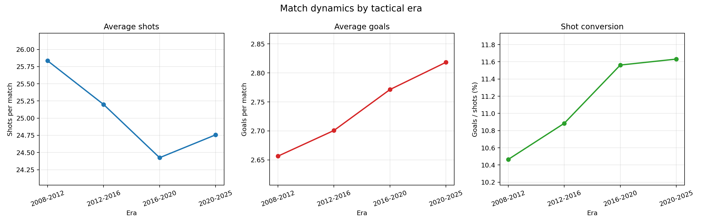

이 그래프는 평균 슈팅, 평균 득점, 슈팅 전환율을 각각 분리해서 보여준다. 시대가 지날수록 평균 슈팅은 감소하는 반면, 평균 득점과 슈팅 전환율은 증가하는 흐름이 나타난다.

### 9.2 시즌별 슈팅, 득점, 슈팅 전환율 지수 변화

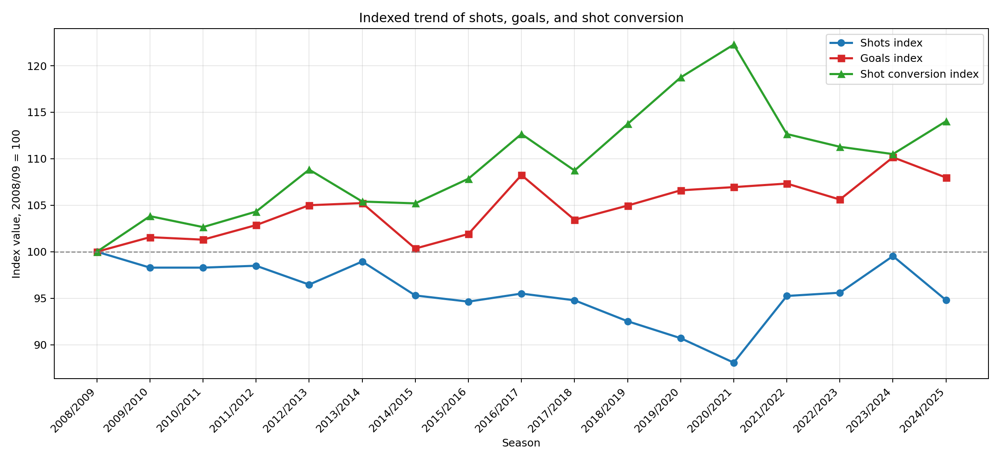

슈팅 수, 득점, 슈팅 전환율은 단위가 다르기 때문에 2008/09 시즌을 100으로 설정한 지수화 그래프를 생성하였다. 이를 통해 슈팅 수는 감소하거나 정체되는 반면, 득점과 슈팅 전환율은 상승하는 흐름을 더 직관적으로 확인할 수 있다.

### 9.3 저득점 경기와 고득점 경기 비율 변화

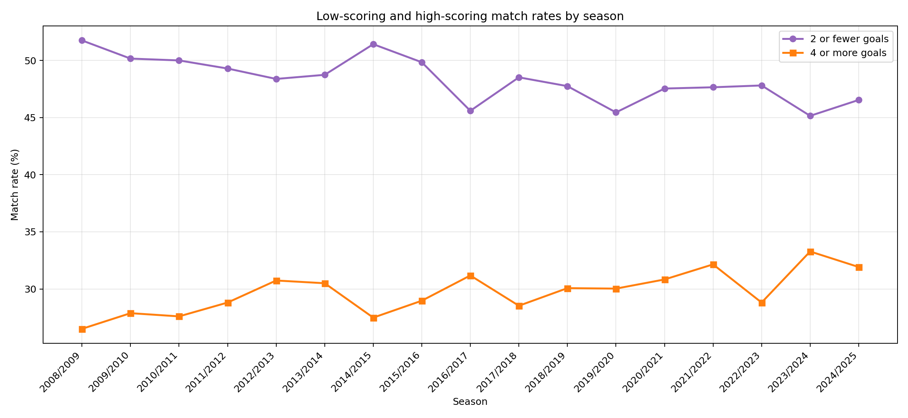

2골 이하 경기 비율과 4골 이상 경기 비율을 함께 비교하였다. 현대 축구가 단순히 저득점화되었다면 2골 이하 경기 비율이 증가해야 하지만, 분석 결과에서는 오히려 2골 이하 경기 비율이 감소하거나 큰 증가를 보이지 않았다.

### 9.4 홈 승률, 원정 승률, 무승부 비율 변화

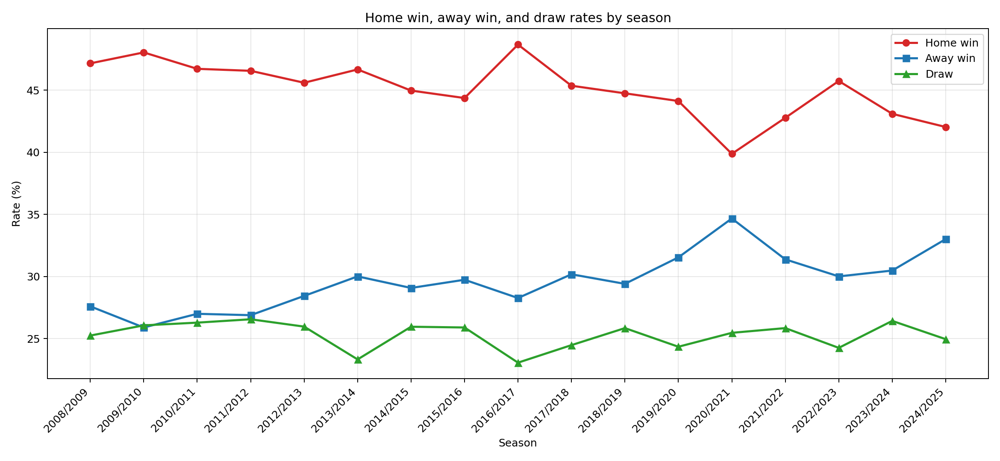

시즌별 홈 승률, 원정 승률, 무승부 비율을 비교하였다. 특히 2020/21 시즌 이후 홈 승률이 낮아지고 원정 승률이 높아지는 흐름이 관찰된다. 다만 본 데이터만으로 원인을 단정할 수는 없다.

### 9.5 리그별 평균 득점 변화

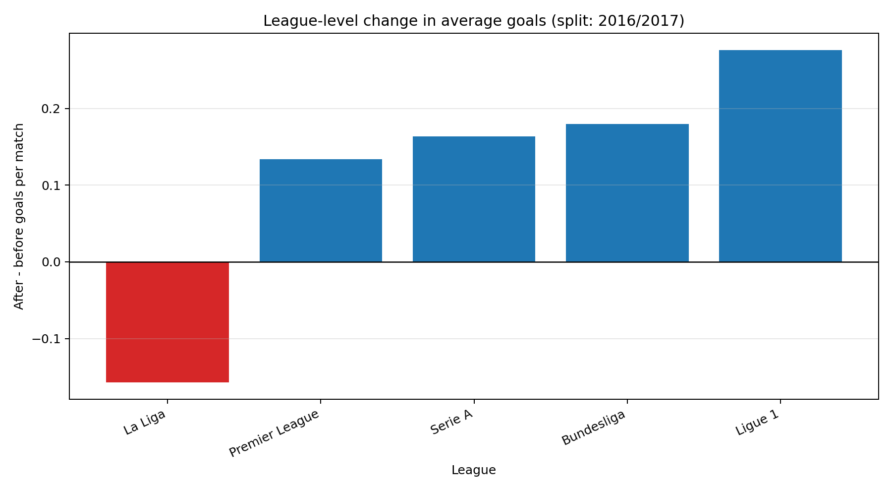

평균 득점은 2016/17 시즌을 기준으로 리그별 전후 차이를 비교하였다. 대부분의 리그에서는 평균 득점이 증가했지만, La Liga에서는 감소하는 결과가 나타났다.

### 9.6 리그별 평균 슈팅 변화

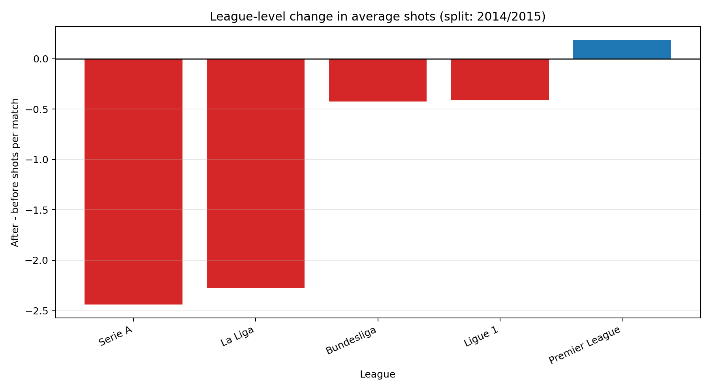

평균 슈팅 수는 2014/15 시즌을 기준으로 리그별 전후 차이를 비교하였다. La Liga와 Serie A에서는 슈팅 수 감소가 크게 나타났지만, Premier League에서는 오히려 소폭 증가하였다.

### 9.7 리그별 슈팅 전환율 변화

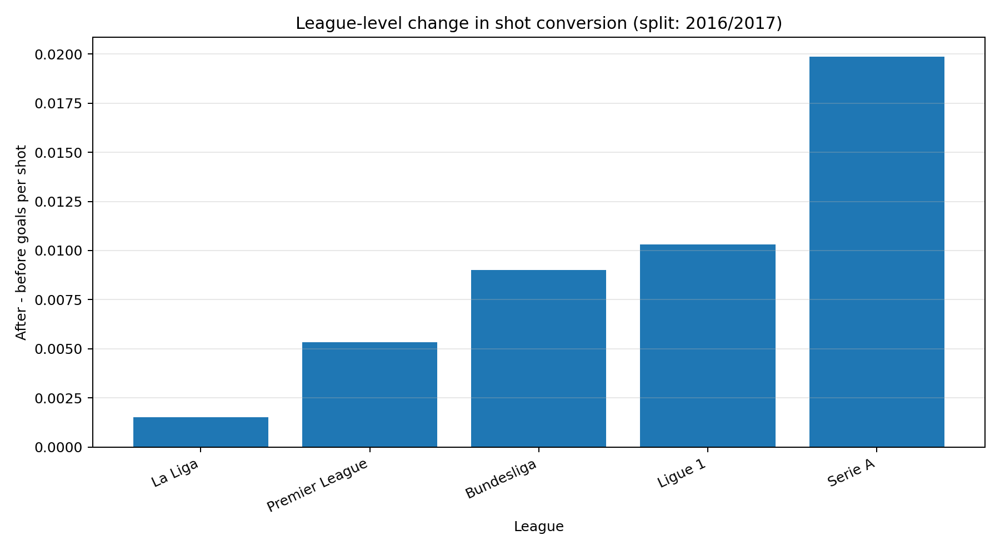

슈팅 전환율은 2016/17 시즌을 기준으로 리그별 전후 차이를 비교하였다. 대부분의 리그에서 슈팅 전환율이 증가하였으며, 이는 현대 축구가 슈팅 수를 늘리기보다는 더 효율적으로 득점하는 방향으로 변화했을 가능성을 뒷받침한다.

### 9.8 Understat xG 기반 공격 기회 품질 변화

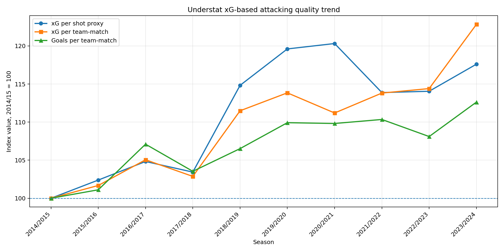

Understat 기반 xG 분석에서는 xG per shot proxy, 팀당 평균 xG, 팀당 평균 득점이 2014/15 시즌 대비 상승하는 흐름이 나타났다. 이는 현대 축구가 더 적은 슈팅으로 더 높은 품질의 기회를 만드는 방향으로 변화했을 가능성을 보여준다.

### 9.9 Understat deep 및 PPDA 변화

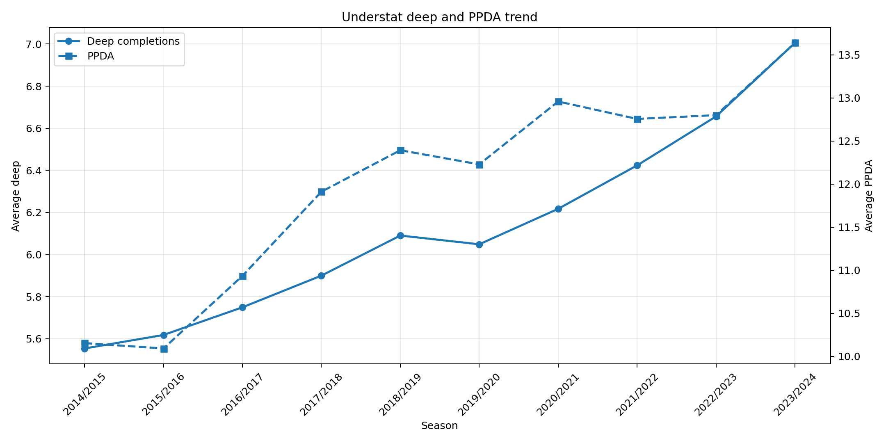

deep 지표는 시간이 지날수록 증가하는 흐름을 보였다. 이는 팀들이 상대 위험 지역에 더 자주 진입하거나 더 깊은 위치에서 공격을 전개하는 경향이 있음을 시사한다. PPDA는 압박 성향과 관련된 지표로 해석할 수 있으나, 본 프로젝트에서는 보조 지표로만 사용하였다.

### 9.10 빅게임의 득점과 슈팅 변화

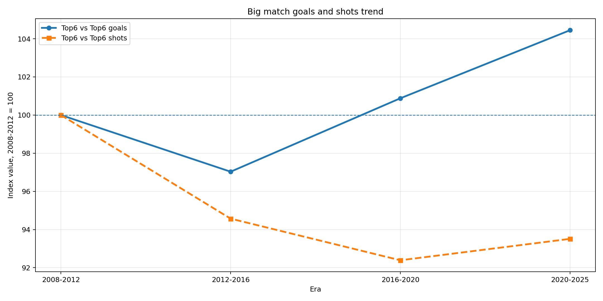

상위 6팀 간 빅게임에서는 평균 득점 지수는 상승했지만 평균 슈팅 지수는 하락하였다. 이는 빅게임이 단순히 저득점화된 것은 아니지만, 슈팅 장면 자체는 감소했을 가능성을 보여준다.

### 9.11 빅게임의 저득점, 고득점, 무승부 비율 변화

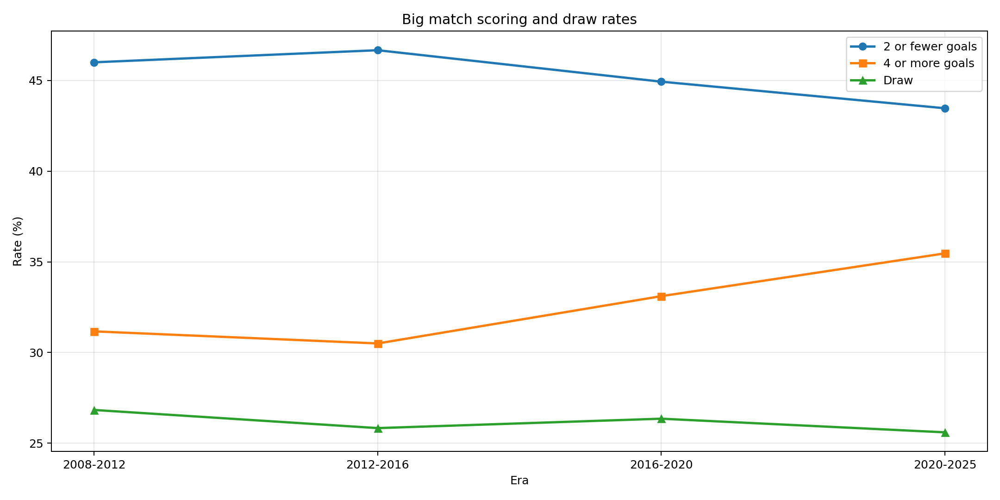

상위 6팀 간 빅게임에서 2골 이하 경기 비율은 감소하고, 4골 이상 경기 비율은 증가하였다. 따라서 빅게임이 저득점화되었다는 설명은 강하지 않다.

### 9.12 경기 유형별 평균 득점과 슈팅 변화

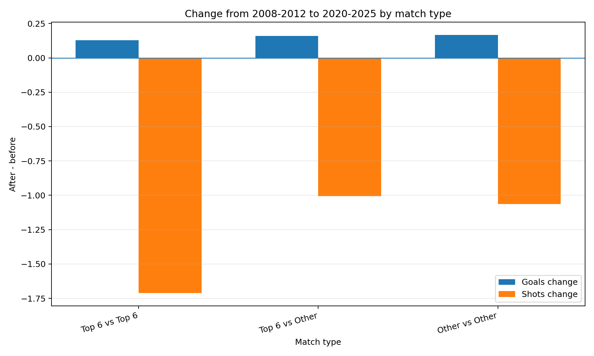

Top 6 vs Top 6, Top 6 vs Other, Other vs Other 모든 경기 유형에서 평균 득점은 소폭 증가하고 평균 슈팅은 감소하였다. 이는 현대 축구의 변화가 특정 경기 유형에만 국한되지 않고, 전반적으로 “슈팅 수 감소와 효율 증가”의 방향으로 나타났음을 보여준다.

---

## 10. 결론

본 프로젝트는 2008/09~2024/25 시즌 유럽 주요 5대 리그 경기 통계를 기반으로 현대 축구의 경기 양상 변화를 분석하였다. 핵심 질문은 “현대 축구는 과거보다 정말 수비적이고 재미없어졌는가?”였다.

분석 결과, 현대 축구는 과거보다 경기당 평균 슈팅 수와 유효슈팅 수가 감소하는 경향을 보였다. 그러나 평균 득점과 슈팅 대비 득점 전환율은 증가하였다. 또한 2골 이하 저득점 경기 비율은 증가하지 않았고, 일부 구간에서는 감소하였다. 따라서 현대 축구가 단순히 수비적이고 저득점화되었다고 보기는 어렵다.

Understat xG 분석에서도 유사한 해석이 가능했다. xG per shot proxy와 팀당 평균 xG는 증가하는 흐름을 보였으며, 이는 슈팅 수 감소가 단순한 공격 축소라기보다 더 높은 품질의 기회를 선택하는 방향의 변화일 가능성을 보여준다.

상위권 팀 간 빅게임 분석에서도 평균 득점은 감소하지 않았다. 오히려 4골 이상 경기 비율은 증가했고, 2골 이하 경기 비율은 감소하였다. 다만 빅게임에서도 평균 슈팅과 유효슈팅은 감소하였다. 따라서 현대 축구가 재미없게 느껴진다면, 그 원인은 단순한 득점 감소보다는 슈팅 장면 수 감소, 더 선별적인 공격 전개, 전술적 안정성 증가 등 경기 전개 방식의 변화와 관련될 가능성이 있다.

추가적으로 football-events 이벤트 데이터를 활용하여 약 173MB 규모의 이벤트 단위 데이터를 HDFS에 적재하고 Spark로 처리하였다. 이 분석을 통해 경기당 이벤트 수, 슈팅 이벤트, 키패스, 빠른 공격, 파울 및 카드 등 경기 체감과 관련될 수 있는 이벤트 구성 지표를 산출하였다. 다만 해당 데이터는 2012~2017 구간에 한정되므로, 장기적인 현대 축구 변화 결론을 직접 대체하기보다는 이벤트 단위 분석 가능성을 보완하는 역할로 해석하였다.

결론적으로 현대 축구는 “공격이 줄어든 축구”라기보다, “공격 기회를 더 선별적으로 사용하고 더 효율적으로 득점하는 축구”로 변화한 것으로 해석할 수 있다. 다만 축구의 재미는 득점과 슈팅 수만으로 설명할 수 없으며, 경기 템포, 돌파 시도, 백패스 비율, 빌드업 시간, 개인 플레이 감소와 같은 이벤트 단위 지표를 추가로 분석할 필요가 있다.

---

## 11. 한계 및 확장 방향

본 프로젝트는 경기 단위 및 팀-경기 단위 통계를 중심으로 분석하였다. 따라서 축구의 “재미”를 직접적으로 측정했다고 보기는 어렵다. 경기의 재미는 득점, 슈팅 수뿐만 아니라 경기 템포, 압박 강도, 개인 돌파, 전술 다양성, 스타 플레이어 의존도 등 다양한 요인에 의해 결정된다.

또한 football-events 데이터는 100MB 이상의 이벤트 단위 데이터로 실제 Spark 분석에 활용되었지만, 공개 데이터의 기간이 2012~2017에 한정되어 있어 2020년대 후반까지 이어지는 장기 변화를 직접 설명하기에는 한계가 있다. 패스 방향, 백패스 비율, 빌드업 시간 등을 정밀하게 계산하기 위해서는 패스 시작·종료 좌표와 이벤트 시퀀스가 포함된 더 세밀한 이벤트 데이터가 필요하다.

향후 확장 방향은 다음과 같다.

1. 이벤트 데이터 기반 전개 방식 분석

   * 백패스 비율
   * 전진패스 비율
   * 빌드업 시작부터 슈팅까지 걸리는 시간
   * 수비 진영에서 공격 진영까지 전개 시간

2. 개인 돌파 및 크로스 변화 분석

   * 드리블 시도 수
   * 드리블 성공률
   * 크로스 시도 수
   * 측면 공격 비율

3. 선수 개인 성과 집중도 분석

   * 리그 득점 상위권 선수의 득점 점유율 변화
   * 특정 슈퍼스타 의존도 변화 분석
   * 득점 분포의 집중도 분석

4. 압박 전술과 부상 위험 분석

   * 압박 강도, 활동량, 경기 수, 부상자 수를 결합한 분석

5. 빅게임 심층 분석

   * 강팀 vs 강팀 경기에서 경기 템포 변화
   * 빅게임과 일반 경기의 전술적 보수성 차이
   * 상위권 팀 간 경기의 슈팅 위치, xG, 패스 전개 비교
  
---

## 12. 참고 자료 및 AI 도구 사용

### 데이터 출처

- football-data.co.uk Match Statistics
- Kaggle Understat Data
- Kaggle football-events
- Kaggle European Soccer Database

### 기술 문서

- Apache Hadoop / HDFS 공식 문서
- Apache Spark 공식 문서
- Kaggle API 문서
- Matplotlib 공식 문서

### AI 도구 사용
- ChatGPT : 디버깅, matpltlib 시각화 아이디어


```
```
